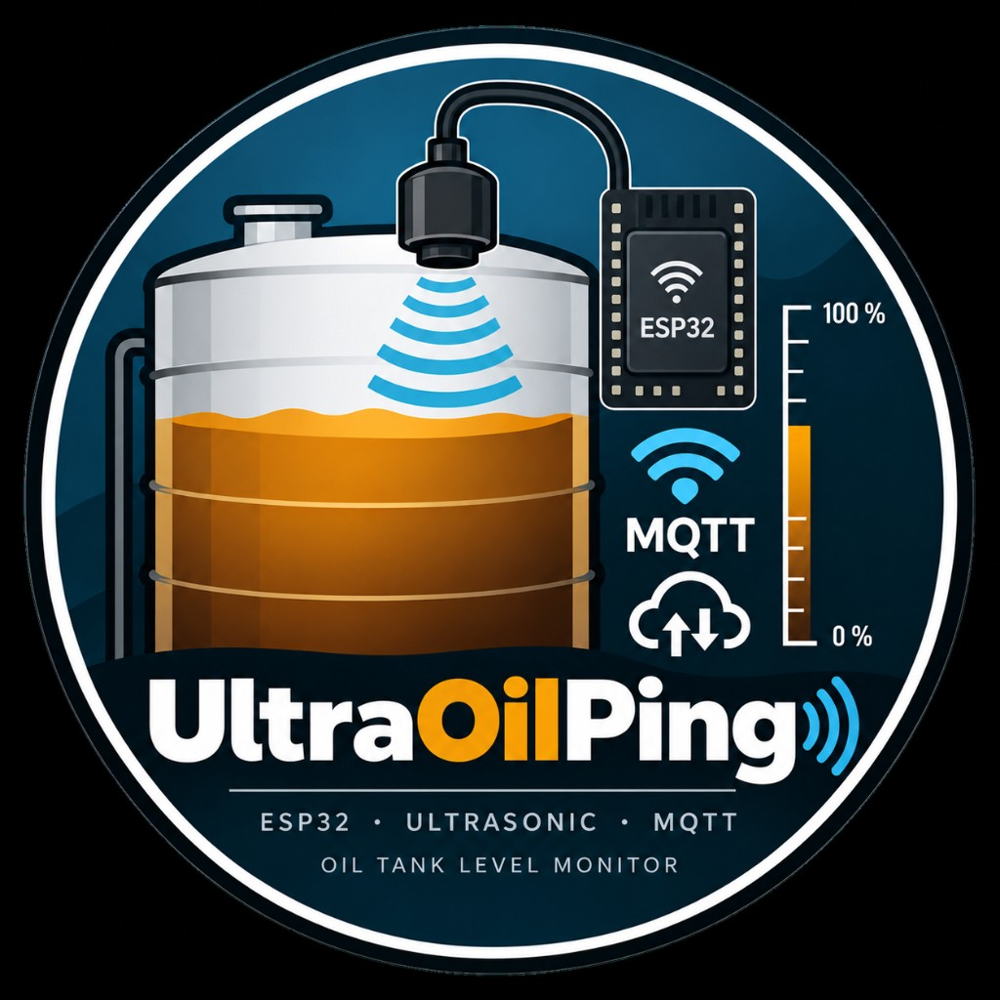

# UltraOilPing – ESP32 ultrasonic oil tank level monitor with MQTT

  

[English](README.md)

ESP32-Firmware für einen Ultraschallsensor ([JSN-SR04T-V3.3](https://esphome.io/components/sensor/jsn_sr04t/) in Mode 2 / M2), die den Abstand zum Ölspiegel misst und optional per MQTT sendet. Zwischen den Zyklen geht das Gerät in den Light Sleep und schaltet die Funkmodule ab.

## Hardware

### Mikrocontroller

- **[ESP32-C3 SuperMini](https://randomnerdtutorials.com/getting-started-esp32-c3-super-mini/)** (in diesem Projekt verwendet)
  - Kompaktes ESP32-C3-Board mit USB-C
  - Pinout / Specs: [Mischianti](https://mischianti.org/esp32-c3-super-mini-high-resolution-pinout-datasheet-and-specs/), [Last Minute Engineers](https://lastminuteengineers.com/esp32-c3-super-mini-pinout-reference/)

### Ultraschallsensor

- **[JSN-SR04T-V3.3](https://esphome.io/components/sensor/jsn_sr04t/)** wasserdichtes Ultraschallmodul (UART)
  - Datenblatt (EN): [JSN-SR04T-V3.3 (übersetztes PDF)](https://make.net.za/wp-content/datasheets/JSN-SR04T-V3.3%20Datasheet%20-%20Translated.pdf)
  - **Hier verwendete Mode-Einstellung:** Lötbrücke **M2** auf der Modul-Platine (Mode 2 / ca. 120 kΩ) → UART-gesteuerte Ausgabe; Trigger mit `0x55` bei 9600 Baud
  - Mode-Übersicht: [Sigmanortec – JSN-SR04T v3.3](https://sigmanortec.ro/en/ultrasonic-sensor-module-jsn-sr04t-v33-waterproof-3-5v)

### Verdrahtung (Defaults in `config.h`)

- GPIO 4 ← Sensor TX
- GPIO 3 → Sensor RX

### Erster Prototyp

  

ESP32-C3 SuperMini angeschlossen an JSN-SR04T-V3.3-Treiberplatine (M2 gelötet) und wasserdichten Ultraschallwandler (Proof-of-Concept-Verdrahtung).

## Funktionen

- Periodische Distanzmessung
- Optional Füllstand (%) und Liter, wenn Distanz leer/voll (und Volumen) gesetzt sind
- MQTT: nur die Distanz als Zahl (z. B. `45.2`)
- **Pro Messung:** WiFi + MQTT verbinden → senden → trennen / Funk aus
- WiFi und MQTT jeweils mit **3 Retries**
- **Light Sleep** zwischen den Zyklen (Wake per Timer oder Serial); ungenutzte Radios aus
- Serielles Konfigurationsmenü (beliebiges Zeichen im Serial Monitor)
- Zeilenende CR / LF / CRLF wird von Enter gelernt und im NVS gespeichert
- Persistenz im ESP32-NVS
- Compile-Zeit-Defaults in `config.h`

## Voraussetzungen

- Arduino IDE oder PlatformIO
- Board: **ESP32-C3 SuperMini** (Arduino-Board: „ESP32C3 Dev Module“, **USB CDC On Boot** aktivieren)
- Bibliothek: [PubSubClient](https://github.com/knolleary/pubsubclient) (Nick O’Leary)

## Schnellstart

1. Repository klonen
2. `config.h` anpassen (SSID, Broker, Pins, WiFi/MQTT ein/aus, …)
3. Sketch `ultrasonic.ino` flashen
4. Serial Monitor öffnen (115200 Baud)
5. Beliebiges Zeichen tippen → Menü; mit `x` speichern

Ohne Einträge in `config.h` kann alles auch nur über das serielle Menü eingerichtet werden.

## Betriebszyklus

1. Distanz messen (und Füllstand/Liter ausgeben, falls kalibriert)
2. Wenn WiFi und MQTT aktiv: verbinden (je bis 3 Versuche) → publish → Netzwerk abbauen
3. Light Sleep bis zum Messintervall **oder** bis Serieneingabe
4. Serial-Wake öffnet das Konfigurationsmenü

Light Sleep statt Deep Sleep, damit Wake per Timer **und** Serial möglich ist (UART-Wakeup + kurze Sleep-Slices für USB-CDC Serial Monitor).

## Konfiguration

### `config.h` (Defaults beim Compile)

| Makro | Bedeutung |
|-------|-----------|
| `CFG_WIFI_ENABLED` / `CFG_MQTT_ENABLED` | WiFi bzw. MQTT standardmäßig an/aus |
| `CFG_WIFI_SSID` / `CFG_WIFI_PASSWORD` | WLAN-Zugangsdaten |
| `CFG_MQTT_*` | Broker, Port, User, Passwort, Topic, Client-ID |
| `CFG_DIST_EMPTY_SET` / `CFG_DIST_FULL_SET` | Kalibrierung aktivieren |
| `CFG_TANK_LITERS_SET` | Tankvolumen aktivieren |
| `CFG_INTERVAL_SEC` | Mess-/Sleep-Intervall |
| `CFG_NET_RETRIES` | Verbindungsversuche WiFi/MQTT (Standard 3) |
| `CFG_NET_RETRY_DELAY_MS` | Pause zwischen Retries |
| `CFG_SLEEP_SLICE_MS` | Light-Sleep-Slice (Serial-Poll / UART-Wake) |
| `CFG_SERIAL_EOL` | Konsolen-Zeilenende: 0=auto, 1=LF, 2=CR, 3=CRLF |

**Hinweis:** Für ein öffentliches Repo keine echten Passwörter in `config.h` committen – lieber das serielle Menü nutzen.

### Serielles Menü

| Taste | Einstellung |
|-------|-------------|
| `0` / `3` | WiFi / MQTT aktiv (0/1) |
| `1`–`2` | WiFi SSID / Passwort |
| `4`–`9` | MQTT-Parameter |
| `a`–`c` | Distanz leer/voll, Tankvolumen (`-` löscht) |
| `d` | Messintervall |
| `e` | Serielles Zeilenende (0=auto, 1=LF, 2=CR, 3=CRLF) |
| `s` | Status / Konfiguration |
| `t` | Testmessung |
| `u` | EOL-Konsistenz-Self-Test |
| `w` | WiFi + MQTT testen (3× Retry, danach Funk aus) |
| `x` / `q` | Speichern & Exit / Abbruch |

Enter wird als CR (`0x0D`), LF (`0x0A`) oder CRLF akzeptiert. Der erkannte Stil gilt für die Menüausgabe und kann gespeichert werden.

## MQTT

- Topic: laut Konfiguration (Default `oiltank/distance`)
- Payload: Distanz in cm, eine Dezimalstelle, z. B. `123.4`
- Retain: aktiv
- Verbindung nur für jedes Publish, danach wieder getrennt

## Lizenz

Dieses Projekt steht unter der [GNU General Public License v3.0](LICENSE).

### Logo

Das UltraOilPing-Logo (`assets/logo.png`) steht unter der [GNU General Public License v3.0](LICENSE).

Es wurde mit ChatGPT (OpenAI) generiert.
