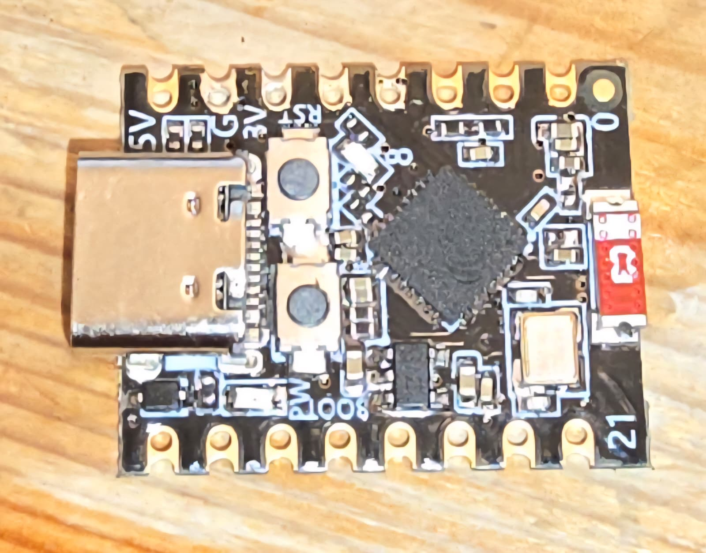
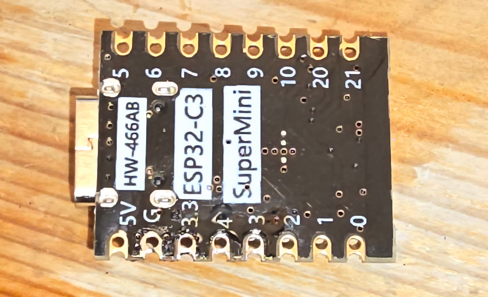
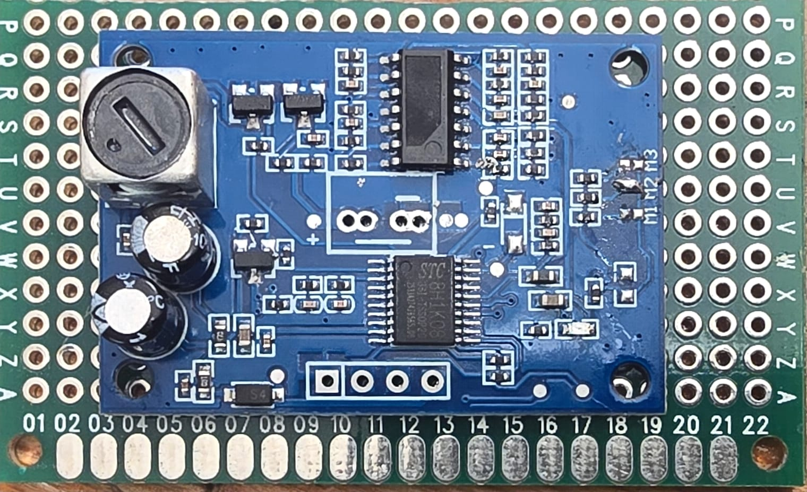
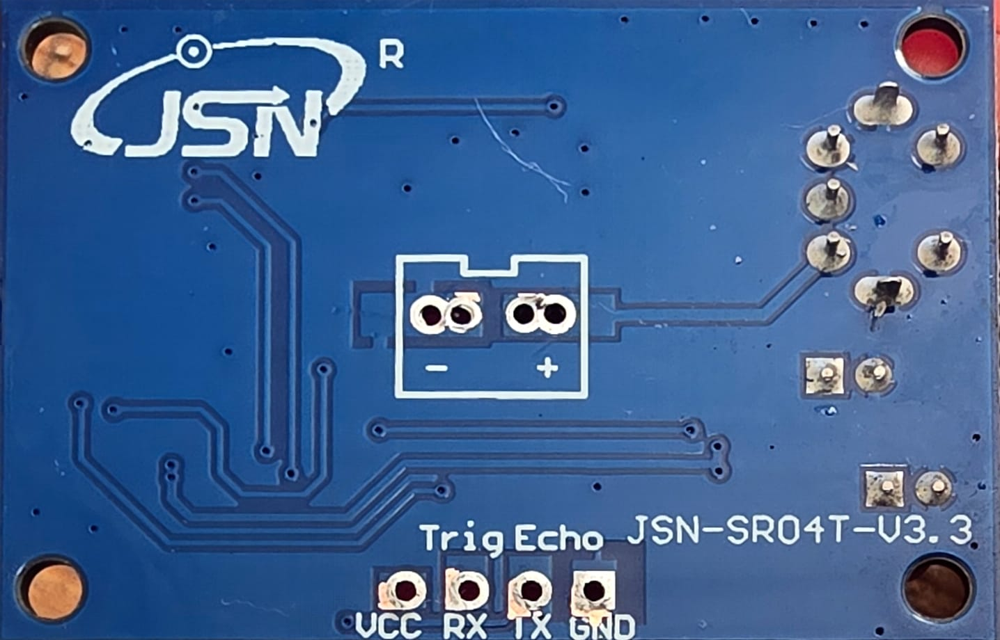
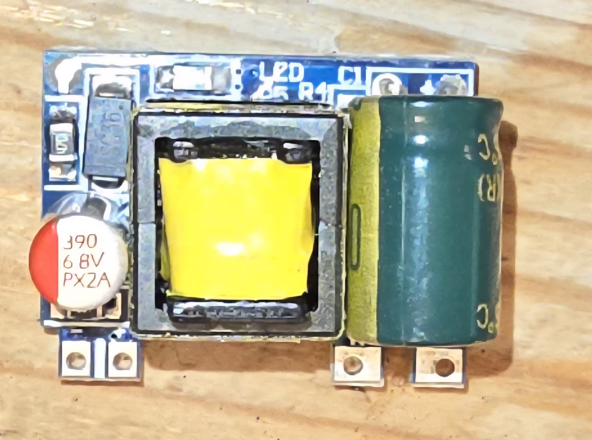
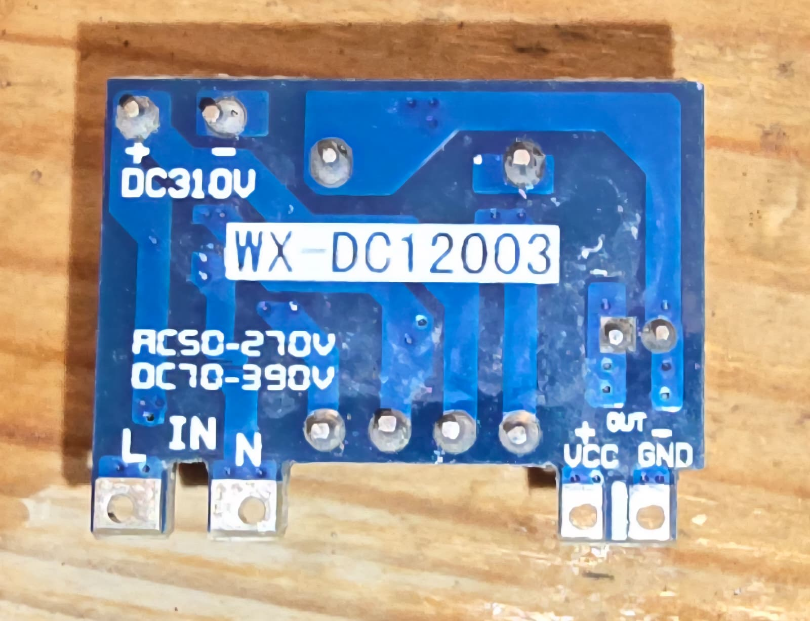
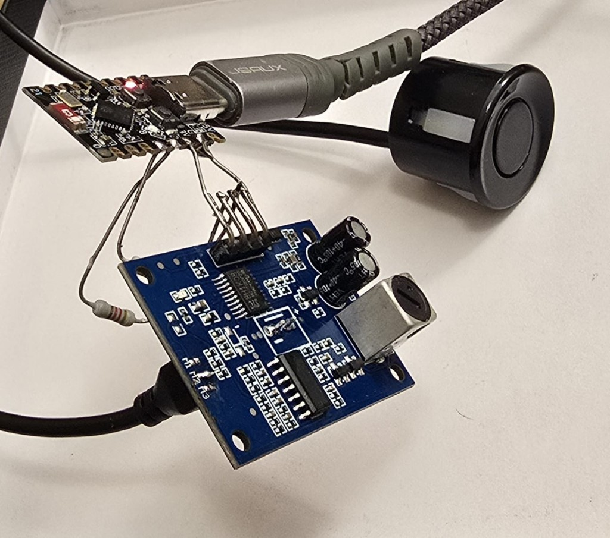
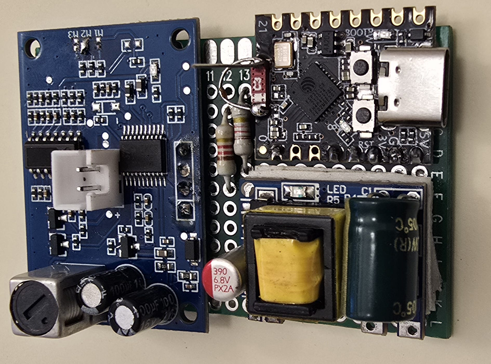
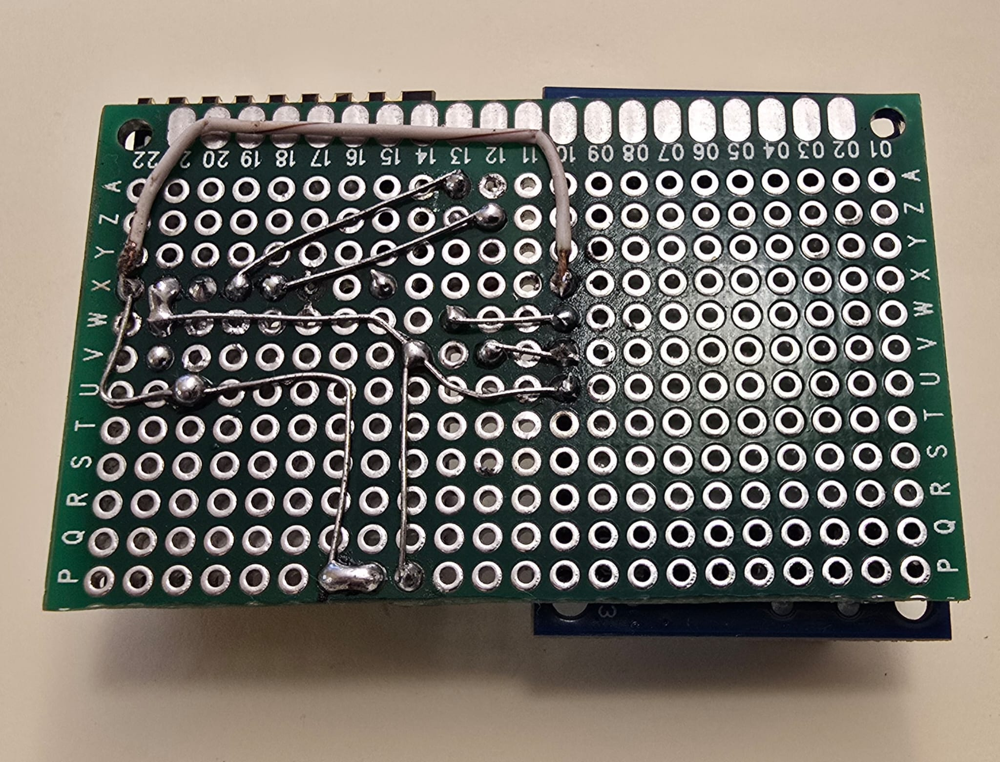

# UltraOilPing – ESP32 ultrasonic oil tank level monitor with MQTT

  

[Deutsch](README.de.md)

ESP32 firmware for an ultrasonic sensor ([JSN-SR04T-V3.3](https://esphome.io/components/sensor/jsn_sr04t/) in Mode 2 / M2) that measures the distance to the oil surface and optionally publishes it via MQTT. Between cycles the device enters light sleep and powers the radios down.

## Hardware

> **Warning — mains voltage**  
> The WX-DC12003 power module is connected to **dangerous mains voltage** on the primary side. Pads marked **DC310V** can carry **more than 300 V DC** when powered from 230 V AC. High voltage may remain stored in the capacitors after power is disconnected. Work only if you are qualified; disconnect and discharge before touching the board. This project documentation is for technical / educational use.

### Microcontroller

- **[ESP32-C3 SuperMini](https://randomnerdtutorials.com/getting-started-esp32-c3-super-mini/)** (used in this project)
  - Compact ESP32-C3 board with USB-C
  - Pinout / specs: [Mischianti](https://mischianti.org/esp32-c3-super-mini-high-resolution-pinout-datasheet-and-specs/), [Last Minute Engineers](https://lastminuteengineers.com/esp32-c3-super-mini-pinout-reference/)
  - **Wi‑Fi range tip:** the stock PCB antenna is weak; a common mod (cut the PCB trace and fit an external antenna) can improve range substantially — see [ESP32-C3 SuperMini antenna modification (Peter Neufeld)](https://peterneufeld.wordpress.com/2025/03/04/esp32-c3-supermini-antenna-modification/)

  
  &nbsp;
  

### Ultrasonic sensor

- **[JSN-SR04T-V3.3](https://esphome.io/components/sensor/jsn_sr04t/)** waterproof ultrasonic module (UART)
  - Datasheet (EN): [JSN-SR04T-V3.3 (translated PDF)](https://make.net.za/wp-content/datasheets/JSN-SR04T-V3.3%20Datasheet%20-%20Translated.pdf)
  - **Mode setup used here:** solder bridge **M2** on the module PCB (Mode 2 / ~120 kΩ) → UART-controlled output; trigger with `0x55` at 9600 baud
  - Mode overview: [Sigmanortec – JSN-SR04T v3.3](https://sigmanortec.ro/en/ultrasonic-sensor-module-jsn-sr04t-v33-waterproof-3-5v)

  
  &nbsp;
  

### Power supply — WX-DC12003 AC/DC module

Compact **isolated** AC/DC switching power supply module used to power the assembly from mains.

- Wide input range: approx. **50–277 V AC** or **70–390 V DC**
- Commonly available in several output variants (this build uses a **~12 V** class module such as WX-DC12003)
- Pinout (bottom silk): **L / N** = AC input; **VCC (+) / GND (−)** = DC output
- Useful reference material often includes datasheets, reverse-engineered schematics, PCB/component ID, pinout notes, photos, and measurements

  
  &nbsp;
  

> **Dangerous mains voltage** is present on the primary side of this module.  
> The pads marked **DC310V** can carry more than **300 V DC** when powered from 230 V AC. High voltage may remain stored in the capacitors after power is disconnected.

### Assembly notes

- **Insulation:** All boards (ESP32-C3 SuperMini, JSN-SR04T-V3.3, and WX-DC12003) are insulated on the **underside** with **double-sided foam adhesive tape** so solder joints and pads cannot short against the mounting surface or each other.
- Keep primary (mains) wiring physically separated from the low-voltage ESP32 / sensor side.
- Do not touch the PSU while powered; after disconnect, wait and treat capacitors as charged until safely discharged.

### Wiring (defaults in `config.h`)

- GPIO 4 ← sensor TX *(see `SENSOR_RX_PIN` / `SENSOR_TX_PIN` in `config.h`)*
- GPIO 3 → sensor RX
- GPIO 8 → onboard LED (active low) — publish feedback
- GPIO 9 → BOOT button (active low) — wake + measure/publish

### Prototypes

**v1 – breadboard / loose wiring**

  

ESP32-C3 SuperMini wired to a JSN-SR04T-V3.3 driver board (M2 soldered) and waterproof ultrasonic transducer.

**v2 – perfboard assembly** (ESP32-C3 SuperMini with antenna wire mod, JSN-SR04T-V3.3 with M2, WX-DC12003 PSU; module undersides insulated with double-sided foam tape)

  
  &nbsp;
  

## Features

- Periodic distance measurement in **millimeters**
- Optional fill level (%) and liters when empty/full distance (mm) and tank volume are set
- Optional **max distance** (mm): larger readings are an error (no publish, LED 5×)
- MQTT: distance only, integer mm (e.g. `1234`)
- **Per measurement:** WiFi + MQTT connect → publish → disconnect / power off radios
- WiFi and MQTT connect with **3 retries** each
- LED (GPIO 8): **1 blink** = publish OK, **5 blinks** = publish / sensor / max-distance error
- BOOT button (GPIO 9): wake from sleep and run a full measure + publish cycle
- **Light sleep** between cycles (wake on timer, serial, or button); unused radios off
- Serial configuration menu (any key in the Serial Monitor)
- Serial line ending CR / LF / CRLF learned from Enter and stored in NVS
- Persistence in ESP32 NVS
- Compile-time defaults in `config.h`

## Requirements

- Arduino IDE or PlatformIO
- Board: **ESP32-C3 SuperMini** (Arduino board: “ESP32C3 Dev Module”, enable **USB CDC On Boot**)
- Library: [PubSubClient](https://github.com/knolleary/pubsubclient) (Nick O’Leary)

## Quick start

1. Clone the repository
2. Edit `config.h` (SSID, broker, pins, WiFi/MQTT on/off, …)
3. Flash `ultrasonic.ino`
4. Open the Serial Monitor (115200 baud)
5. Press any key → menu; save with `x`

Everything can also be configured only via the serial menu (no secrets required in `config.h`).

## Operation cycle

1. Measure distance (and print level/liters if calibrated)
2. If WiFi and MQTT are enabled: connect (up to 3 attempts each) → publish → tear down network
3. Enter light sleep until the measure interval elapses **or** serial / BOOT button wakes the device
4. Serial wake opens the configuration menu; button wake runs a measure + publish cycle; after the menu (and after reset) an **idle timeout** keeps the device awake before the next power-save

Light sleep is used instead of deep sleep so the device can wake from the timer **and** from serial (UART wakeup + short sleep slices for USB-CDC Serial Monitor).

## Configuration

### `config.h` (compile-time defaults)

| Macro | Meaning |
|-------|---------|
| `CFG_WIFI_ENABLED` / `CFG_MQTT_ENABLED` | WiFi / MQTT on by default |
| `CFG_WIFI_SSID` / `CFG_WIFI_PASSWORD` | WLAN credentials |
| `CFG_MQTT_*` | Broker, port, user, password, topic, client ID |
| `CFG_DIST_EMPTY_SET` / `CFG_DIST_FULL_SET` | Enable empty/full calibration (mm) |
| `CFG_DIST_MAX_SET` / `CFG_DIST_MAX_MM` | Max distance (mm); over = error |
| `CFG_TANK_LITERS_SET` | Enable tank volume |
| `CFG_INTERVAL_SEC` | Measure / sleep interval |
| `CFG_IDLE_TIMEOUT_SEC` | Awake grace after reset / serial before power-save |
| `CFG_NET_RETRIES` | WiFi / MQTT connect attempts (default 3) |
| `CFG_NET_RETRY_DELAY_MS` | Delay between retries |
| `CFG_SLEEP_SLICE_MS` | Light-sleep slice length (serial poll / UART wake) |
| `CFG_SERIAL_EOL` | Console line ending: 0=auto, 1=LF, 2=CR, 3=CRLF |

**Note:** Do not commit real passwords to a public repo — use the serial menu instead.

### Serial menu

| Key | Setting |
|-----|---------|
| `0` / `3` | WiFi / MQTT enabled (0/1) |
| `1`–`2` | WiFi SSID / password |
| `4`–`9` | MQTT parameters |
| `a`–`c` | Distance empty/full (mm), tank volume (`-` clears) |
| `g` | Distance max (mm; over = error, `-` clears) |
| `d` | Measure interval |
| `f` | Idle timeout before power-save (seconds) |
| `e` | Serial line ending (0=auto, 1=LF, 2=CR, 3=CRLF) |
| `s` | Status / configuration |
| `t` | Test measurement |
| `u` | EOL consistency self-test |
| `w` | Test WiFi + MQTT (retry 3×, then power off) |
| `x` / `q` | Save & exit / quit without saving |

Enter is accepted as CR (`0x0D`), LF (`0x0A`), or CRLF. The detected style is used for menu output and can be saved.

## MQTT

- Topic: as configured (default `oiltank/distance`)
- Payload: distance in **mm** as integer, e.g. `1234`
- Retain: enabled
- Connection is established only for each publish, then closed
- If distance &gt; configured max: error (no MQTT publish, LED blinks 5×)

## License

This project is licensed under the [GNU General Public License v3.0](LICENSE).

### Logo

The UltraOilPing logo (`assets/ultraoilping-logo.png`) is licensed under the [GNU General Public License v3.0](LICENSE).

It was generated with ChatGPT (OpenAI).
